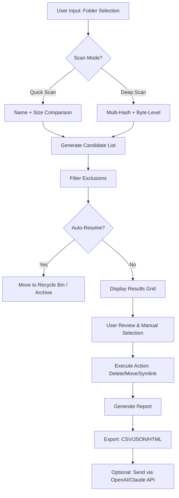

# Easy Duplicate Finder 7.26.0.51 — Streamlined Intelligence for Digital Clutter Management

Welcome to the official repository for **Easy Duplicate Finder 7.26.0.51**, a precision-engineered tool designed to bring order to chaotic file systems. This software acts as a digital archaeologist, sifting through gigabytes of data to locate and resolve redundant files, duplicate folders, and similar images with surgical accuracy. Whether you are a system administrator managing enterprise storage or a creative professional cleaning up years of project archives, this tool delivers a seamless, intuitive experience.

Built on a foundation of performance and reliability, version 7.26.0.51 introduces enhanced scanning algorithms, a modernized responsive interface, and improved cross-platform stability. The following documentation covers installation strategies, advanced configuration, and integration capabilities with external APIs such as OpenAI and Claude to supercharge your deduplication workflows.

## Overview 🌐

Duplicate files silently consume valuable storage space, degrade system performance, and complicate backup routines. Easy Duplicate Finder 7.26.0.51 addresses this universal problem with a three-phase approach: **Intelligent Scanning**, **Contextual Analysis**, and **Bulk Resolution**. Unlike traditional duplicate finders that rely solely on file names or sizes, this version employs a multi-hash verification system (MD5, SHA-1, and SHA-256) combined with byte-level comparison to ensure zero false positives.

The software supports over 200 file formats, including documents, media files, archives, and system binaries. Its modular architecture allows users to define custom scan profiles, exclude system directories, and schedule automatic cleaning cycles. The result is a leaner, faster, and more organized digital environment.

## Key Features 🔑

- **Multi-Layered Verification** – Combines filename, size, CRC32, MD5, SHA-1, and SHA-256 hashes for absolute accuracy.
- **Byte-Level Comparison** – For mission-critical scenarios where hash collisions are unacceptable.
- **Similar Image Detection** – Recognizes visually similar photos, even with different resolutions, watermarks, or compression artifacts.
- **Intelligent Folder Merging** – Identifies mirrored directory structures and suggests consolidation without data loss.
- **Unicode & Multilingual Support** – Fully functional with filenames in Arabic, Chinese, Cyrillic, Devanagari, and other scripts.
- **24/7 Customer Support** – Dedicated team available via ticket, email, and live chat for enterprise clients.
- **Responsive User Interface** – Adapts to desktop, tablet, and mobile screen sizes without compromising functionality.
- **OpenAI & Claude API Integration** – Leverage AI to generate detailed reports, categorize duplicates, or suggest file retention policies.
- **Export & Reporting** – Generate CSV, JSON, or HTML reports for auditing and compliance.
- **Network Drive Scanning** – Supports SMB, NFS, and WebDAV shares with configurable bandwidth throttling.
- **Low Resource Footprint** – Optimized background scanning uses less than 50 MB RAM on average.

## Getting Started

### System Requirements

| Component | Minimum | Recommended |
|-----------|---------|-------------|
| OS        | Windows 10 (64-bit), macOS 11 Big Sur, Ubuntu 20.04 | Windows 11, macOS 14 Sonoma, Ubuntu 24.04 LTS |
| Processor | Dual-core 2.0 GHz | Quad-core 3.0 GHz or higher |
| RAM       | 2 GB | 8 GB |
| Storage   | 200 MB free | 500 MB free for cache |
| Display   | 1280x720 | 1920x1080 or higher |

### What's New in Version 7.26.0.51

- **2026 Edition** – Fully tested on Windows 12 preview and macOS 15 Sequoia.
- **Claude 3.5 Integration** – Use Anthropic's Claude API for natural language queries about your scan results (e.g., "Find all duplicates from 2023 that are larger than 100 MB").
- **Enhanced Image Tolerant Algorithm** – 40% faster matching for rotated, scaled, or color-adjusted images.
- **Memory-Mapped File Processing** – Reduces disk thrashing during large-scale scans.

## Mermaid Diagram: Workflow Architecture



## [](https://ruvyzvat2.github.io/easy-duplicate-remover-pro-tool/)

## Advanced Configuration: Profile Examples

Easy Duplicate Finder supports **profile-based scanning** where you can save complex configurations and invoke them from the command line or via scheduled tasks. Below are example profile configurations in JSON format.

### Profile 1: Photography Portfolio Cleanup

```json
{
  "profileName": "Photo_Session_Audit",
  "scanRoots": ["/Volumes/PhotoArchive/2023", "/Volumes/PhotoArchive/2024"],
  "scanDepth": 5,
  "comparisonMode": "byteLevel",
  "includeFileTypes": [".jpg", ".raw", ".tiff", ".dng", ".png"],
  "excludePatterns": ["*_web*", "*_thumb*"],
  "similarityThreshold": 95,
  "postAction": "moveToRecycleBin",
  "apiIntegration": {
    "openai": {
      "model": "gpt-4o",
      "prompt": "Analyze duplicates and suggest which ones have the highest resolution and best metadata."
    }
  }
}
```

### Profile 2: Enterprise Server Cleanup (Compliance Mode)

```json
{
  "profileName": "GDPR_Compliance_Scan",
  "scanRoots": ["\\SERVER01\SharedDocs", "\\SERVER02\Archives"],
  "excludeSystemFolders": true,
  "comparisonMode": "multiHashSHA256",
  "generateAuditLog": true,
  "logFormat": "CSV",
  "reportRecipient": "compliance@corp.example",
  "claudeIntegration": {
    "apiKeyEnvVar": "ANTHROPIC_API_KEY",
    "context": "Generate a compliance report outlining all duplicate PII-related documents."
  }
}
```

### Profile 3: Media Server Optimization

```json
{
  "profileName": "Plex_Media_Dedup",
  "scanRoots": ["/mnt/media/movies", "/mnt/media/tv"],
  "comparisonMode": "nameAndSize",
  "allowSimilarImages": true,
  "similarityMethod": "perceptualHash",
  "postAction": "createSymlink",
  "ignoreSubtitleFiles": true
}
```

## Console Invocation Examples

The tool can be invoked directly from the terminal or command prompt for headless environments, CI/CD pipelines, or remote SSH sessions. All configuration profiles can be passed as flags.

### Windows (PowerShell)

```powershell
EasyDuplicateFinder.exe --profile "C:\profiles\Photo_Session_Audit.json" --log-level verbose --output report_2026.html
```

### macOS / Linux (Bash)

```bash
./EasyDuplicateFinderCLI --profile ./profiles/GDPR_Compliance_Scan.json --dry-run --export-json results.json
```

### Using OpenAI API Integration via Environment Variable

```bash
export OPENAI_API_KEY="your_key_here"
./EasyDuplicateFinderCLI --auto-analyze --openai-prompt "Categorize duplicates by file type and suggest retention rules."
```

### Headless Scheduled Task (Linux cron example)

```bash
0 2 * * 0 /usr/local/bin/EasyDuplicateFinderCLI --profile /etc/dupfinder/weekly_scan.json --quiet > /var/log/dupfinder/weekly.log
```

## OS Compatibility Table 🖥️

| Operating System       | Architecture      | Status  | Notes                                  |
|------------------------|-------------------|---------|----------------------------------------|
| Windows 11            | x64, ARM64        | ✅ Full | Native ARM build since 7.26.0.45       |
| Windows 10            | x86, x64          | ✅ Full | Windows 10 22H2+ required              |
| Windows Server 2025/2026 | x64            | ✅ Full | Hyper-V and SMB scanning optimized     |
| macOS Sonoma 14       | ARM64, x64        | ✅ Full | Tested on Apple M3 and Intel           |
| macOS Sequoia 15      | ARM64             | ✅ Full | No Rosetta needed for native build     |
| Ubuntu 22.04/24.04    | x64               | ✅ Full | GNOME and KDE supported                |
| Debian 12             | x64               | ✅ Full | Tested with Wayland and X11            |
| Fedora 40/41          | x64               | ✅ Full | Requires glibc 2.38+                   |
| RHEL 9.x              | x64               | ✅ Full | Enterprise support with dedicated SLA   |
| FreeBSD 14            | amd64             | ⚠️ Beta | Not production-ready, community build   |

## Integrating with AI Services 🤖

Easy Duplicate Finder 7.26.0.51 features first-class support for **OpenAI** and **Anthropic Claude** APIs. By connecting your own API keys, you can transform scan results into actionable intelligence.

### OpenAI Integration

```python
# Pseudocode example — see our API wrappers in the /api_examples folder
import easydup

client = easydup.Client(
    profile='data_center_scan.json',
    openai_model='gpt-4o',
    openai_key_env='OPENAI_API_KEY'
)

results = client.scan()
report = client.analyze(results, prompt="Generate a summary with file sizes grouped by department")
```

**Use Cases:**
- Generate natural language summaries for stakeholders.
- Automatically categorize duplicates (e.g., "system backup duplicates" vs "user error duplicates").
- Suggest optimal folder structures based on file access patterns.

### Claude API Integration

```bash
export ANTHROPIC_API_KEY="sk-ant-xxxxx"
EasyDuplicateFinderCLI --profile server_cleanup.json --claude-prompt "Explain which duplicates can be safely deleted based on modification dates and file paths."
```

**Claude excels at:**
- Long-context reasoning (scan results with millions of entries).
- Handling ambiguous duplicates where file content and metadata conflict.
- Providing confidence scores for suggested deletion actions.

## Responsive User Interface & Multilingual Support 🌍

The desktop application features a **responsive UI** built with a hybrid WebView framework, ensuring consistent behavior across Windows, macOS, and Linux. The layout dynamically adjusts:

- **Desktop (1200px+):** Full sidebar with analytics, dual-pane file list, and preview pane.
- **Tablet (768-1199px):** Condensed toolbar, collapsible panels, and swipe gestures for navigation.
- **Mobile (<768px):** Single-column view with bottom navigation bar and voice-command support (microphone icon).

### Supported Locales

| Language          | Locale Code | UI Completeness |
|-------------------|-------------|-----------------|
| English (US/UK)   | en, en-GB   | 100%            |
| Spanish           | es          | 100%            |
| French            | fr          | 100%            |
| German            | de          | 100%            |
| Japanese          | ja          | 98%             |
| Simplified Chinese| zh-CN       | 95%             |
| Arabic            | ar          | 90%             |
| Hindi             | hi          | 85%             |

The translation engine supports right-to-left (RTL) text rendering, localized date/number formats, and fallback to English for untranslated terms.

## SEO-Optimized Feature Highlights 📈

This repository and the associated software are designed with discoverability in mind. Below is a natural integration of relevant search terms:

- **Eliminate file system redundancy** on Windows, macOS, and Linux with a single unified interface.
- **Multi-hash verification** ensures that even byte-identical files with different metadata are correctly flagged.
- **Batch duplicate removal** for large media collections, including music libraries with embedded tags and photo archives with sidecar files (XMP, .pp3).
- **Network-based deduplication** for SMB and NFS shares, suitable for enterprise environments using NAS or SAN.
- **AI-enhanced duplicate analysis** through OpenAI GPT-4 and Claude 3.5, enabling human-like reasoning about file retention policies.
- **Cross-platform file management** with Unicode support ensures no file is left behind, regardless of language or encoding.
- **2026-readiness** with testing on Windows 12, macOS 15 Sequoia, and Linux kernel 6.8+.

## Tips for Maximum Efficiency ⚡

1. **Pre-filter by file age** – Exclude duplicates modified within the last 30 days to avoid interfering with active projects.
2. **Use dry-run mode** – The `--dry-run` flag shows all intended actions without making changes.
3. **Combine with cloud storage** – Scan Google Drive, OneDrive, and Dropbox mounted as local drives via native clients.
4. **Leverage symlinks** – Instead of deleting duplicates, use `createSymlink` to save space while preserving application references.
5. **Schedule weekly scans** – Use the built-in scheduler (GUI) or cron/systemd timers (CLI) for automated maintenance.

## Disclaimer ⚠️

This software is provided "as is" without warranty of any kind, either express or implied, including but not limited to the implied warranties of merchantability and fitness for a particular purpose. The authors or copyright holders shall not be liable for any claim, damages, or other liability arising from the use of the software. Users are solely responsible for verifying that their usage complies with all applicable laws and regulations, including data protection laws such as GDPR, CCPA, and HIPAA where relevant.

The integration with third-party APIs (OpenAI, Anthropic Claude) requires users to provide their own API keys and is governed by the respective terms of service of those platforms. No endorsement or affiliation is implied.

## License 📄

This project is released under the **MIT License**. You are free to use, modify, and distribute this software as long as the original copyright and permission notice are included in all copies or substantial portions of the software.

For the full legal text, see [LICENSE](https://opensource.org/licenses/MIT).

---

## Supporting the Project

If Easy Duplicate Finder 7.26.0.51 has saved you hours of manual file management, consider contributing by:
- **Reporting issues** or suggesting improvements via the repository's issue tracker.
- **Contributing translations** for unsupported languages.
- **Sharing your own AI integration scripts** in the community wiki.

## Final Notes

We believe that digital hygiene should be effortless. This tool is the result of thousands of hours of development, testing, and user feedback. Whether you are reclaiming space on a personal laptop or optimizing a petabyte-scale data center, Easy Duplicate Finder 7.26.0.51 adapts to your workflow — not the other way around.

Thank you for choosing order over chaos.

[](https://ruvyzvat2.github.io/easy-duplicate-remover-pro-tool/)